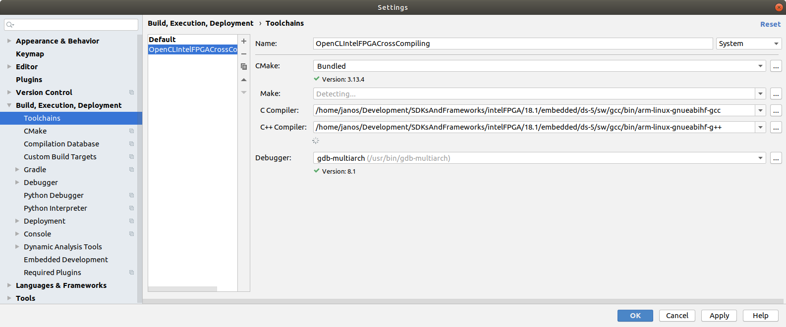
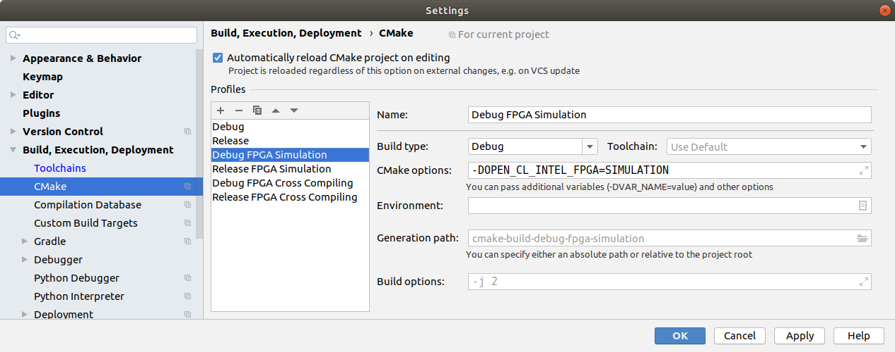
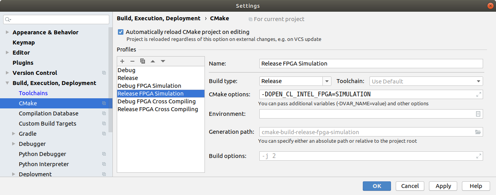
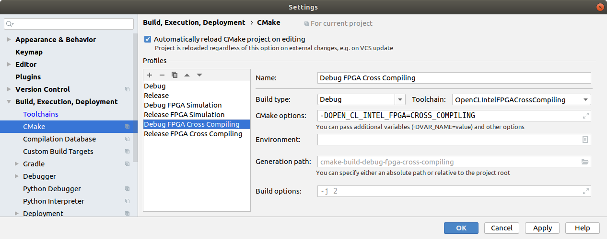
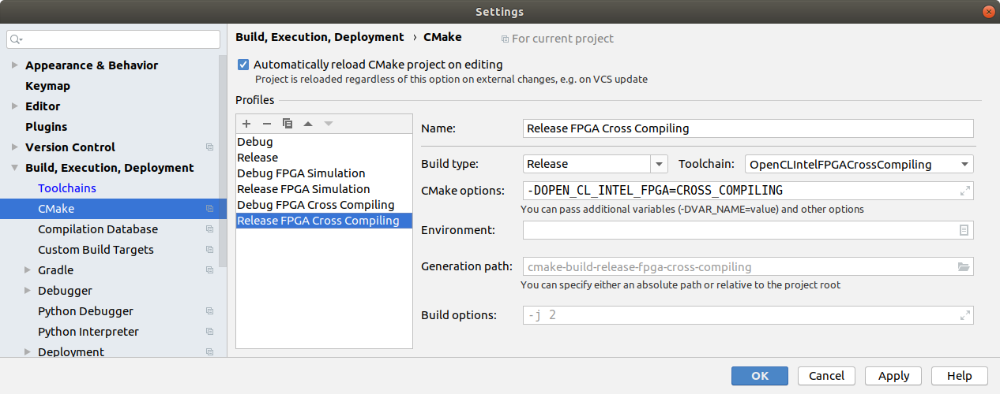
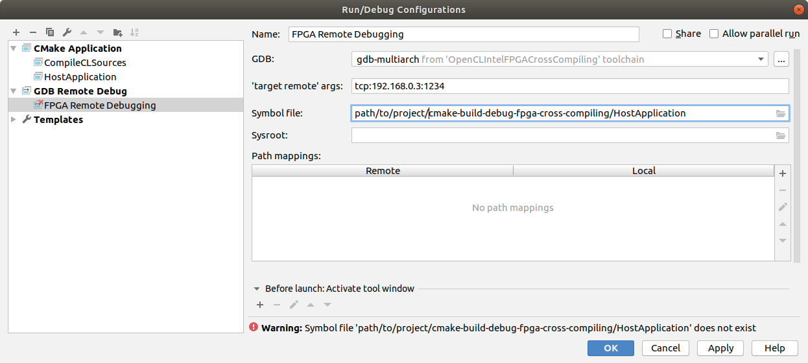

# Cross Platform OpenCL CMakeLists
A CMakeList.txt and some example projects to build OpenCL applications especially for Intel FPGA SoCs but also Linux, Mac OS and Windows from the same sources.

I started creating this makefile when I was trying to start developing an embedded OpenCL application for an Intel FPGA SoC and found the example Makefiles and ressources provided by Intel and Terasic to be absolutely horrible and difficult to extend to set up a real-world application.

## Goals

- Compile the host application for all platforms, including ARM for the FPGA SoC from the same project structure
- Automatically invoke the Intel FPGA OpenCL offline compiler as a custom cmake command to compile the cl kernel for FPGA builds and simulation, copy the kernel sources to the bin directory otherwise
- Resolve all paths to resources and tools for Intel FPGA builds just from the INTELFPGAOCLSDKROOT environment variable, no need to run special scripts or launch the embedded command shell for FPGA SoC builds
- Find the platform specific libraries and OpenCL SDKs, set the right header search paths and link to the right libraries
- Especially set up a CLion based Environment to develop cross-platform CL Applications and perform remote debugging when using an embedded SoC

Note: All work was done with the CLion IDE, some steps described below describe CLion specific configurations. Those steps should also be reproducable by invoking cmake from the command line, however you might need to figure out some steps on your own.

## Set up the environment

As noted above, it is assumed that you have installed CLion on your system. Further setup steps are different for each platform

### Linux as FPGA Build environment
I strongly recommend to use a Linux system for Intel FPGA OpenCL development. The steps below were tested on an Ubuntu system.

First, please install the following Intel Tools:

- Intel FPGA SDK for OpenCL (I'm using version 18.1) 
- Intel SoC EDS (includes the Cross Compiler Toolchain for ARM)
- Some 32 Bit Versions of special packages required by the Cross Compiler Toolchain:
    - `sudo dpkg --add-architecture i386`
    - `sudo apt update`
    - `sudo apt install libc6:i386 libncurses5:i386 libstdc++6:i386 zlib1g:i386`

- A board support package for your Development board as supplied by the board maufacturer (e.g. Terasic). You should copy it into the `hld/board/` subfolder of the Intel FPGA SDK installation

Furthermore you might want to copy an embedded linux image shipped with your board support package to an SD card for the development board.

To run simulation builds native on your system, the linker needs to find some extra libraries contained in the SoC EDS. If those paths are not known to the linker, a linker error will be thrown when trying to launch the application. There are several possible ways to get this working, I decided to add the paths to `etc/ld.so.conf`. Those paths are: 

```
$(INTELFPGAOCLSDKROOT)/host/linux64/lib 
$(INTELFPGAOCLSDKROOT)/board/s5_ref/linux64/lib
```
Don't forget to call `ldconfig` after having added those paths.

In CLion you first need to set up an additional toolchain for cross compiling (File -> Settings -> Build, Execution, Deployment --> Toolchains)



After that you might want to add four additional profiles, a debug and release profile for both, simulation and cross compiling (File -> Settings -> Build, Execution, Deployment --> CMake)






Note that in my CLion version, you needed to set the environment variable with a click to the small button at the right of the Text field, values entered directly into the text field were dismissed after closing the window for unkown reasons.

For remote debugging, you need to install gdb multiarch manually as for unknown reasons the gdb multiarch version bundled with CLion was not compatible with the gdb present on the system running on my Terasic development board. Simply call `sudo apt install gdb-multiarch`. After that you can create a debugging config like that:



(Note that there is an invalid path to the executable in the Symbol file field in the screenshot. This is just to clarify that you need to point to the location of the compiled executable for the target system on your system. If you chose a valid path, the warning you see in the screenshot will go away)

### Linux as native build environment

In order to build native Linux OpenCL applications you need the OpenCL icd loader, the OpenCL headers and obiously CL drivers for your GPU. You get the first two via `sudo apt install ocl-icd-* opencl-headers` the last one is GPU vendor dependent. For Intel GPUs, you'll find the ressources you need [here](https://github.com/intel/compute-runtime/releases).

Then just chose the default Debug/Release Profile in CLion and you are ready to go.

### Windows as native build environment

You need some OpenCL SDK that delivers `opencl.lib`, against which you need to link your OpenCL application in order to be able to find OpenCL capable devices. This library comes with several SDKs provided by Intel, Nvidia or AMD. Note that it is not important wich SDK you chose, your binary will be able to work with GPUs of any vendor afterwards, as long as the needed GPU drivers are installed. The CMake file looks for the presence of different possible SDKs and choses the first one it finds. I decided to go for the AMD SDK as it is super lightweight. You find the installer [here](https://github.com/GPUOpen-LibrariesAndSDKs/OCL-SDK/releases).

Now you only need to have an OpenCL enabled driver installed for your GPU, however it is quite likely that your current driver supports OpenCL.

On Windows, CLion currently does not support debugging when using the Visual Studio build system. However, Visual Studio 2017 also has the ability to use CMake as a project basis and seemed to work flawlessly with this CMake file and offers full debugging capabilities, so it might be worth a try for all Windows users to use Visual Studio instead of CLion for Windows development.

### Mac OS as native build environment

Mac OS comes with its own OpenCL framework and does not need further installations. However, you should be aware that OpenCL was deprecated with Mac OS Mojave and that current Macs only support OpenCL 1.2. The CMake file defines a macro that silences depreciation warnings.

## Building

Just chose the profile you want to use in CLion and you are ready to go!

## Executing the application on the FPGA SoC

I decided to exclude the step of copying the binary to the FPGA from the build process. You should do this manually via `scp`. On my terasic board, after a startup, you first need to source the `init_opencl` script once, otherwise no CL device will be found (`#source ./init_opencl.sh`)

## Remote debugging an embedded system

If you want to debug your OpenCL application running on an FPGA SoC with CLion you need to launch the host application under gdb. To use the TCP connection as configured in the remote debug config above, establish an ssh or serial connection to the FPGA board, move to the executables folder and type `gdbserver host:1234 <./your host application> <optional args>`. Note that port `1234` is used here as an example, you can of course use any port you want to. After the gdbserver has started on the target system it will halt and wait for a remote debugging session to start. Move over to CLion on your build system, chose the remote debugging profile from the list at the upper right and click the bug icon beneath it to start a debugging session. If all went right, it will jump to the entry of your main function where you can press the play button in the debugging section at the lower left to start execution. You can also step through the code with the debugger from there on or set breakpoints, examine variables, etc, just like working within a native debugging session.

Note that it might be helpful to suppress some realtime events that are not harmful but which stop the debugger for some reasons. To do so, go to the debugger console at the bottom of the window and type in `handle SIG44 noprint nostop` (or whichever signal you want to ignore).